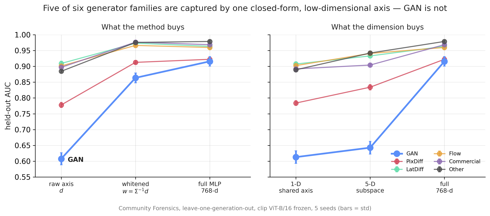

# The geometry of cross-generator AI-image detection

Can a frozen vision backbone tell real from AI-generated images *without ever being trained on
fakes*, and when does that break on a generator family it has never seen? A characterization of
why generator-agnostic detection succeeds or fails — not a proposed detector.

**TL;DR** — A single closed-form direction (`Σ⁻¹(μ_fake − μ_real)`, no training) recovers most
of what a trained MLP gets on held-out generator families. The exception is GAN, which sits off
the subspace the other families span.



## Setup

**Data** — [Community Forensics](https://huggingface.co/datasets/OwensLab/CommunityForensics-Small),
all 599 shards scanned, six families: **GAN, PixDiff, LatDiff, Flow, Commercial, Other**.
family from its `architecture`; Flow is separated from Commercial 

**Backbones** — CLIP, SigLIP2, DINOv2, MAE, ViT (all ViT-Base, frozen): five pretraining
objectives, so a result holding across all of them is not a property of CLIP alone.

**Protocol** — leave-one-generation-out, 5 seeds, 16,000 images per draw (1,500 per family
balanced across its generators, 7,000 real). `d = μ_fake − μ_real`; `w = Σ⁻¹d` is the same line
with content variance divided out (Fisher's LDA).

**One control up front** — CF stores reals as JPEG and most fakes as PNG at a few fixed
resolutions, so a classifier reading only format, resolution and bytes-per-pixel separates them
at **AUC 0.968**, never seeing a pixel. Every image is re-encoded to JPEG q96 with chroma
subsampling off, as [GenImage](https://arxiv.org/abs/2306.08571) does. Subsampling matters: PIL
applies 4:2:0 at every quality, costing CLIP 4× more feature drift than DINOv2 — which would
confound the cross-backbone comparison itself.

## Results

Held-out-family AUC, mean over six families and 5 seeds (`analysis/whiten.py`):

| backbone | pretraining | raw `d` | **whitened `w`** | trained MLP | GAN only: `w` vs MLP |
| --- | --- | --- | --- | --- | --- |
| CLIP | image–text | 0.830 | **0.945** | 0.952 | 0.864 vs **0.916** |
| SigLIP2 | image–text | 0.804 | **0.910** | 0.916 | 0.736 vs **0.787** |
| DINOv2 | self-sup. | 0.781 | **0.857** | 0.866 | 0.676 vs **0.730** |
| MAE | self-sup. | 0.739 | **0.874** | 0.864 | 0.654 vs 0.670 |
| ViT | supervised | 0.762 | **0.835** | 0.831 | 0.612 vs 0.625 |

- **Whitening carries the result, capacity adds little.** `d → w` gains +0.07–0.14 everywhere;
  `w →` MLP moves ±0.01.
- **Except on GAN**, where the MLP leads by up to +0.05. GAN is also where `analysis/subspace.py`
  collapses: a probe restricted to the 5-D span of the *other* families' directions scores 0.643
  on GAN against 0.916 for the full 768-d probe — the same restriction costs LatDiff only 0.03.
- **Not a vision-language effect** — the ordering holds for self-supervised and supervised
  backbones too.
- **LID is not the signal** (`analysis/lid.py`), the hypothesis this project started from.
  Per-image LID alone reaches 0.848 against 0.975 for raw features; concatenating it gives 0.979.
- **An ensemble of per-family specialists does not beat one pooled probe** (`analysis/ensemble.py`):
  0.971 max / 0.960 mean vs 0.975 pooled.

<details>
<summary>Transfer matrix (CLIP, rows = fit on, columns = scored on)</summary>

| fit \ scored | GAN | PixDiff | LatDiff | Flow | Comm | Other |
| --- | --- | --- | --- | --- | --- | --- |
| **GAN** | 0.98 | 0.85 | 0.76 | 0.74 | 0.64 | 0.77 |
| **PixDiff** | 0.87 | 0.96 | 0.85 | 0.87 | 0.85 | 0.89 |
| **LatDiff** | 0.69 | 0.83 | 0.98 | 0.91 | 0.97 | 0.93 |
| **Flow** | 0.74 | 0.83 | 0.95 | 0.99 | 0.97 | 0.93 |
| **Comm** | **0.60** | 0.77 | 0.96 | 0.87 | 0.99 | 0.86 |
| **Other** | 0.79 | 0.85 | 0.93 | 0.94 | 0.94 | 1.00 |

Asymmetric: Commercial→GAN gives 0.60, barely above chance, while LatDiff/Flow/Commercial form
a mutually-transferable cluster (0.87–0.97) that GAN sits outside. Mean off-diagonal by backbone:
0.844 CLIP, 0.812 SigLIP2, 0.768 DINOv2, 0.763 MAE, 0.758 ViT.

`analysis/twonn.py`: every fake family sits on a lower-dimensional manifold than the reals
(19.9 vs 13.2–18.2 at layer 12, CLIP), but the gap does not order families the way transfer
difficulty does. `analysis/alignment.py` is a consistency check, not a result — the quantity it
correlates is close to true by construction.

</details>

## Running it

```bash
scripts/reproduce.sh all        # or: provenance | maps | extract | compose | analysis
```
Individual stages run from the repo root as modules
(`python -m analysis.whiten --backbone clip --seeds 5`, `python tests/test_cf_data.py`).

```
scripts/     reproduce.sh — one entry point
pipeline/    build_maps -> extract -> compose
analysis/    whiten (headline), transfer, subspace, lid, twonn, directions, alignment, ensemble
utils/       geometry (d and w), backbones, heads, split budget, paths, figures
data/        maps, features, composed draws (gitignored)
```

Features are extracted once per backbone, then re-drawn many times (`--seed` = a fresh draw).
All analyses share one split budget (`utils/cf_data.py`) so numbers are comparable across files,
and every probe trains on a 1:1 real/fake pool. Each writes a JSON and a 300-dpi PNG to
`figures/`; **[`figures/README.md`](figures/README.md) says what each one shows and what to look
for.**

